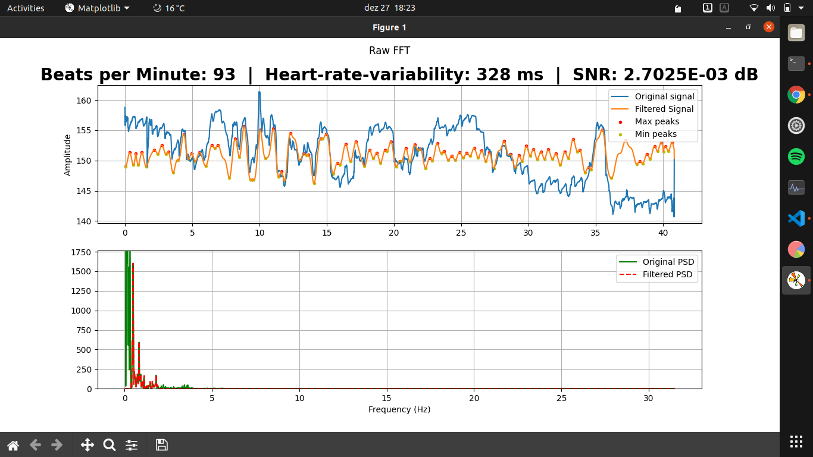

# FingerPy

FingerPy is a algorithm using python, scipy and fft to measure, analyse and monitor heart-beat using only a video of the user's finger on a mobile cellphone camera.


## Setup
On the repository directory:
```pip3 install -r requirements.txt```


## Usage
1. Record a video pressing your finger against the camera
2. Copy video to ```/samples```
3. ```python3 main.py samples/your_video.mp4|avi|MOV```


### Example
Video on ```/samples```

```python3 main.py samples/test_finger.avi```


Result: 


